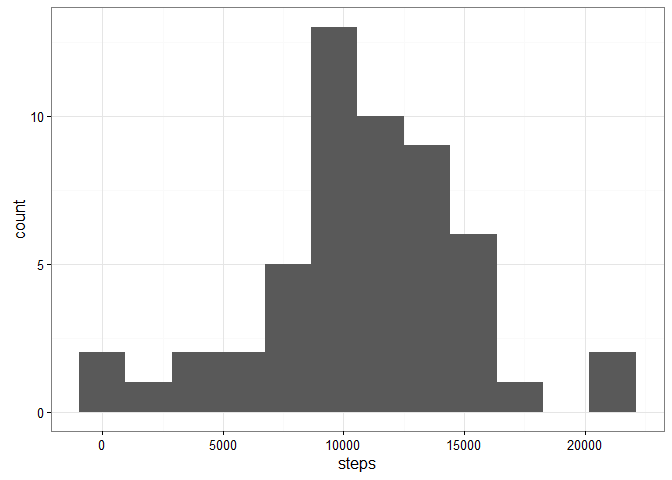
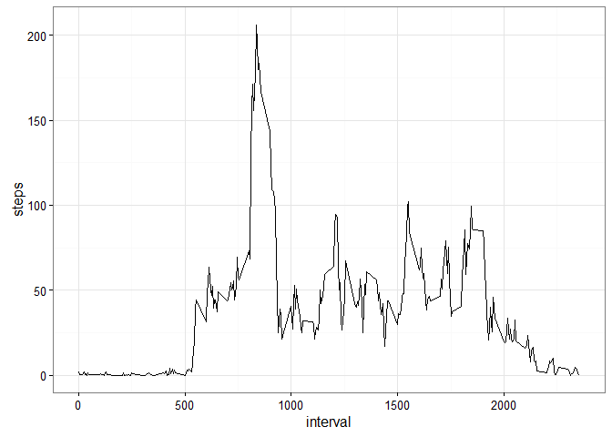

# Reproducible Research: Peer Assessment 1


## Loading libraries
Some commonly used libaries are loaded first. Also, set some defaults for ggplot.


```r
library(dplyr)
library(lubridate)
library(stringr)
library(ggplot2)
theme_set(theme_bw())
```


## Loading and preprocessing the data

### Loading
Reading in activity data directly from zip file:

```r
activityData <- read.csv(unzip("activity.zip", "activity.csv"), na.strings = NA)
```

### Processing
Transform the date field from factor to POSIX date, using dplyr and lubridate. Transforming to an actual date format will allow for easier analysis later on.
Also construct a datetime from date and interval. Interval has to be mutated twice, first to have a string for constructing the datetime, then again so we have it in a usable format for later.

```r
activityData <- activityData %>%
    mutate(date = as_date(date)) %>%
    mutate(interval = str_pad(interval,4,side = "left", pad = 0)) %>%
    mutate(timestamp = parse_date_time(paste0(date,interval),"YmdHM")) %>%
    mutate(interval = as.numeric(interval))
```

## What is mean total number of steps taken per day?
To find out, dplyr comes in handy. Group by date and summarize will do to get the daily sums.

```r
ad_SumStepsPerDay <- activityData %>%
    group_by(date) %>%
    summarise(steps = sum(steps))
```

### Histogram
A histogram shows the distribution of daily steps. The warning message tells us that for 8 days, no data was recorded.


```r
ggplot(ad_SumStepsPerDay, aes(steps)) +
    geom_histogram(bins = 8)
```

```
## Warning: Removed 8 rows containing non-finite values (stat_bin).
```



**10000 to 12000 steps** were taken on the majority of days, as it appears.

### Mean and median values
Let's take a closer look and compute mean and median daily steps. This can conveniently be done using the function summary(). However, it does floor/ceil so we don't get the exact numbers. Using the respective functions yields a more precise result. NA's have to be removed to get a result.


```r
summary(ad_SumStepsPerDay$steps)
```

```
##    Min. 1st Qu.  Median    Mean 3rd Qu.    Max.    NA's 
##      41    8841   10760   10770   13290   21190       8
```

```r
mean(ad_SumStepsPerDay$steps, na.rm = TRUE)
```

```
## [1] 10766.19
```

```r
median(ad_SumStepsPerDay$steps, na.rm = TRUE)
```

```
## [1] 10765
```

**Mean and median** lie very close together apparently.

## What is the average daily activity pattern?

### Time series plot
Since the data is divided into intervals that repeat every day, we can compute the mean steps grouped by interval to deduce the average activity pattern. NA's have to be explicitly omitted here.


```r
ad_meanStepsPerInterval <- activityData %>%
    na.omit %>%
    group_by(interval) %>%
    summarise(steps = mean(steps))

ggplot(ad_meanStepsPerInterval, aes(interval, steps)) +
    geom_line()
```



### What interval had the highest step count?
To find out which interval had the highest step count on average, a short dplyr command will get the answer.

```r
ad_meanStepsPerInterval %>%
    filter(steps == max(steps))
```

```
## Source: local data frame [1 x 2]
## 
##   interval    steps
##      (dbl)    (dbl)
## 1      835 206.1698
```
**Interval 835 contains the highest average**, at 206 steps.

## Imputing missing values

### Number of missing values
First, we want to know how many values are missing. Counting the complete cases, then using the command table to figure out how many values are missing (the FALSE count). 

```r
completeActivityData <- complete.cases(activityData)
table(completeActivityData)
```

```
## completeActivityData
## FALSE  TRUE 
##  2304 15264
```
So there are **2304 missing values**.

### Imputing strategy
A simple imputing strategy might be filling all NA values with the mean values of the respective interval. First of all, extract the incomplete records into their own object, then fill the NA's, finally merging together a new, complete dataset with all the other complete cases. Calling summary() confirms that there are no longer any NA's present

```r
incompleteActivityData <- activityData %>% filter(is.na(steps))
incompleteActivityData$steps <- apply(incompleteActivityData,1,function(row){
     i <- as.numeric(row["interval"])
     row["steps"] <- ad_meanStepsPerInterval$steps[ad_meanStepsPerInterval$interval == i]
     })
completeActivityData <- bind_rows(
    activityData %>% filter(!is.na(steps)), incompleteActivityData
) %>% arrange(timestamp)
summary(completeActivityData)
```

```
##      steps             date               interval     
##  Min.   :  0.00   Min.   :2012-10-01   Min.   :   0.0  
##  1st Qu.:  0.00   1st Qu.:2012-10-16   1st Qu.: 588.8  
##  Median :  0.00   Median :2012-10-31   Median :1177.5  
##  Mean   : 37.38   Mean   :2012-10-31   Mean   :1177.5  
##  3rd Qu.: 27.00   3rd Qu.:2012-11-15   3rd Qu.:1766.2  
##  Max.   :806.00   Max.   :2012-11-30   Max.   :2355.0  
##    timestamp                  
##  Min.   :2012-10-01 00:00:00  
##  1st Qu.:2012-10-16 05:58:45  
##  Median :2012-10-31 11:57:30  
##  Mean   :2012-10-31 11:57:30  
##  3rd Qu.:2012-11-15 17:56:15  
##  Max.   :2012-11-30 23:55:00
```

## Are there differences in activity patterns between weekdays and weekends?
